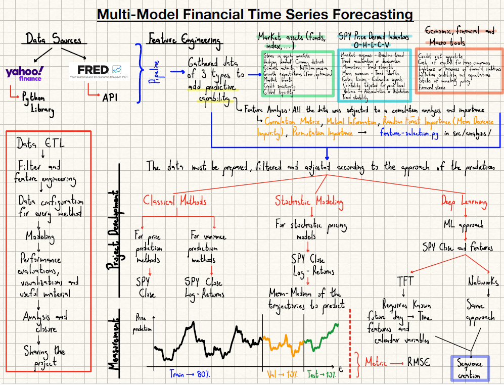
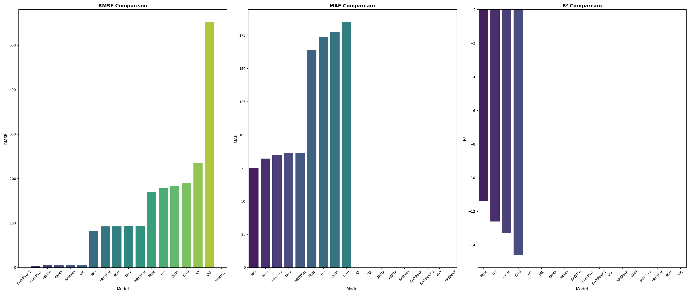

# Multi-Model Financial Time Series Forecasting

## Overview

This project implements a comprehensive multi-model approach to financial time series forecasting, focusing on predicting the price movements and volatility of the SPY ETF (SPDR S&P 500 ETF Trust), which tracks the S&P 500 index. The system integrates classical statistical models, deep learning architectures, and stochastic processes to provide robust and multiple predictions for financial time series data.

## Key Features

- **Data Acquisition**: Automated retrieval of historical SPY price data from Yahoo Finance and additional economic indicators from FRED (Federal Reserve Economic Data).
- **Feature Engineering**: Incorporation of technical indicators and macroeconomic features to enhance predictive analysis.
- **Data Processing Pipeline**: First the data consolidation, missing value imputation, temporal splitting, and robust scaling for model training.
- **Multi-Model Framework**: Implementation of diverse forecasting models spanning classical time series methods, neural networks, and stochastic differential equations.
- **Model Evaluation**: Systematic evaluation and comparison of model performance across multiple metrics and prediction horizons. The absolute metric of comparison is RMSE, but MAE and R2 were used in some cases for better perspective.

## Project Structure

### Data Pipeline
- **Data Extraction** (`src/data-extraction/`): Scripts for downloading raw financial data from external sources.
- **Data Processing** (`src/data-processing/`): Modules for data cleaning, feature engineering, consolidation, and preprocessing.
- **Prepared Data** (`src/data/prepared/`): Train, validation, and test datasets ready for modeling.

### Modeling Framework
- **Classical Models** (`src/models/classical-models/`): Traditional statistical approaches including AR, MA,ARMA, ARIMA, SARIMA, SARIMAX, VAR VARMAX and volatility models like ARCH, GARCH and DCC-GARCH.
- **Deep Learning Models** (`src/models/deep-learning-models/`): Neural network architectures such as RNN, GRU, LSTM, and Temporal Fusion Transformer (TFT).
- **Stochastic Models** (`src/models/stochastic-models/`): Mathematical models based on stochastic processes including Geometric Brownian Motion, Heston model, Merton Jump Diffusion, Kou Model and NIG Model.

### Analysis and Evaluation
- **Feature Selection** (`src/analysis/feature-selection.py`): Methods for identifying the most predictive features.
- **Model Evaluations** (`src/evaluations/`): Comprehensive assessment of each model's forecasting accuracy and includes some visualization to enhance and support the model's development.
- **Outputs** (`outputs/`): Saved model artifacts, evaluation results, and analysis visualizations.

### Configuration
- **Parameters** (`configurations/`): YAML configuration files defining hyperparameters and settings for different model categories.

## Models Implemented

### Classical Time Series Models
- Autoregressive (AR)
- Moving Average (MA)
- Autoregressive Moving Average (ARMA)
- Autoregressive Integrated Moving Average (ARIMA)
- Seasonal ARIMA (SARIMA)
- Seasonal ARIMA with Exogenous Variables (SARIMAX)
- Vector Autoregression (VAR)
- Vector Autoregression Moving Average (VARMAX)

### Volatility Models
- Autoregressive Conditional Heteroskedasticity (ARCH)
- Generalized ARCH (GARCH)
- Dynamic Conditional Correlation GARCH (DCC-GARCH)

### Stochastic Process Models
- Geometric Brownian Motion (GBM)
- Merton Jump Diffusion
- Heston Stochastic Volatility
- Double Exponential Jump Diffusion (Kou)
- Normal Inverse Gaussian (NIG)

### Deep Learning Models
- Recurrent Neural Network (RNN)
- Gated Recurrent Unit (GRU)
- Long Short-Term Memory (LSTM)
- Temporal Fusion Transformer (TFT)

### Development Aspects
- **Train, Validation and Test Split:** The train set (80%) is the input of training for each model. The validation set (10%) give the best hyperparameter configurations, the early stopping for some methods and avoid overfitting. The test set (10%) proves if the refined model is capable of generalize and perform well by facing different situations.

- **Sequence creation for deep learning:** These types of model cannot process a whole dataframe. Because, each file is independent. The sequence creates mini-batches of data starting from a given window for context.

Classic Input --> ['sma50_today, rsi_today, atr_today, ...']

Sequential Input (window = 60) -->
[
    [sma50_60d_ago, rsi_60d_ago, atr_60d_ago, ...],
    [sma50_59d_ago, rsi_59d_ago, atr_59d_ago, ...],
    ....
    ['sma50_yesterday, rsi_yesterday, atr_yesterday, ...'],
    ['sma50_today, rsi_today, atr_today, ...']
]

CNNs Analogy with the (`create_sequences`) function: The sequent length (seq_length) is equivalent to the kernel_size. Both define the window attention or receptive field given to the model. The slide (in the loop --> len(X) - seq_length - horizon + 1) is equivalent to the stride, the "filter" moves 1 step through the tensor (channels = features). 

- **Predictions for Stochastic Models:** As you probably know, the stochastic process based on SDEs running via MonteCarlo simulations does not predict a precise, those methods generates n_sims paths/trajectories. So, in order to predict, the mean and the median were used as a y_pred value.

- **RMSE as the key metric:** This metric is in target units, so it's easy to understand.

- **TFT pipeline adjustments:** 3 critic aspects were done:

   * **Future Known Inputs**, a LSTM "ignore" the calendar, only receive past prices. The TFT require differentiating between what you don't know (future prices) and what yo do know (future dates). The function (`add_time_features`), create artificial normalized columns (0 to 1) that scale the calendar ---> day_of_week (monday = 0 and sunday = 1), day_of_month (first day = 0 and last day = 1) and month (january = 0 and december = 1).
   * **Adding a Tensor**, the DataLoader of RNN, GRU and LSTM deliver 2 things: 
        - The input (X) --> The past [t - 60: t] features.
        - The target (y) --> The future [t: t + 30] prices. Here for the TFT, the model must receive: 
            - A. Encoder Input (X_past) --> features and previous dates
            - B. Decoder Input (X_future) --> only futire dates that are scaled
            - C. Target (y) --> real price to predict
    * **Architecture (Attention + Gating)**, the TFT implements 2 mechanism:
        - In the Variable Selection Network, we use a Gated Linear Unit (GLU), which helps the model suppress noise and focus on the most relevant aspects of the input.
        - Multi-Head Attention (8 heads), connects the Decoder output with the Encoder memory.

## Data Sources 

- **Primary Asset**: SPY ETF historical price data (2005-2025).
- **Economic Indicators**: Federal Reserve Economic Data (FRED) macroeconomic variables.
- **Technical Indicators**: Computed features including moving averages, RSI, MACD, Bollinger Bands, and other technical analysis metrics.

## Dependencies

The project utilizes a comprehensive set of Python libraries for data manipulation, statistical modeling, machine learning (for metrics calculations), and deep learning:

- **Data Processing**: pandas, numpy
- **Statistical Modeling**: statsmodels, arch, scipy
- **Machine Learning**: scikit-learn
- **Deep Learning**: PyTorch
- **Visualization**: matplotlib, seaborn
- **Utilities**: joblib, python-dotenv

## Output Artifacts

- Trained model files (.joblib for classical models, .pth for deep learning models).
- Model evaluation predictions and related matters.
- Feature importance rankings and selection results.
- Data preprocessing objects (scalers).

## Results by method

The following table group the results of each method with the test subset, in order to compare and contrast the method accuracies. The experimental design was as follows: both the classical methods (for price prediction and variance) and the stochastic methods were run twice, and the metric shown in the chart represents the average score.

## Conclusions

***